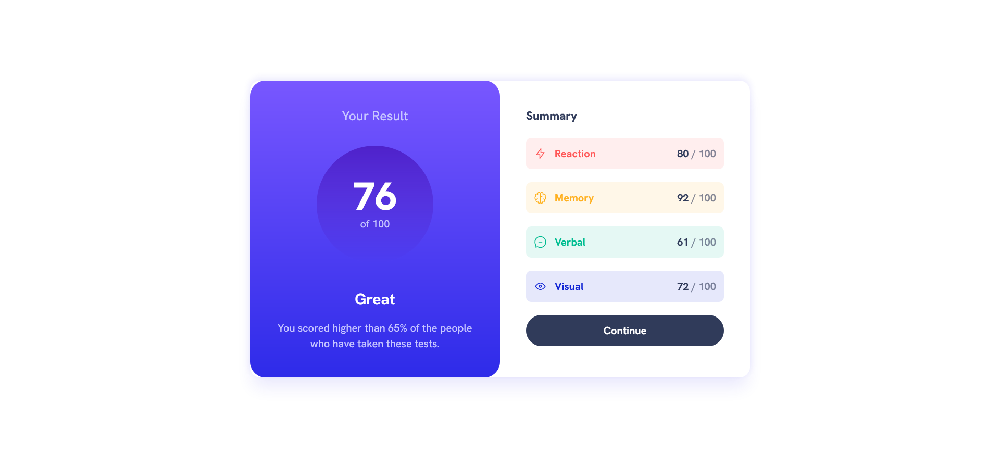
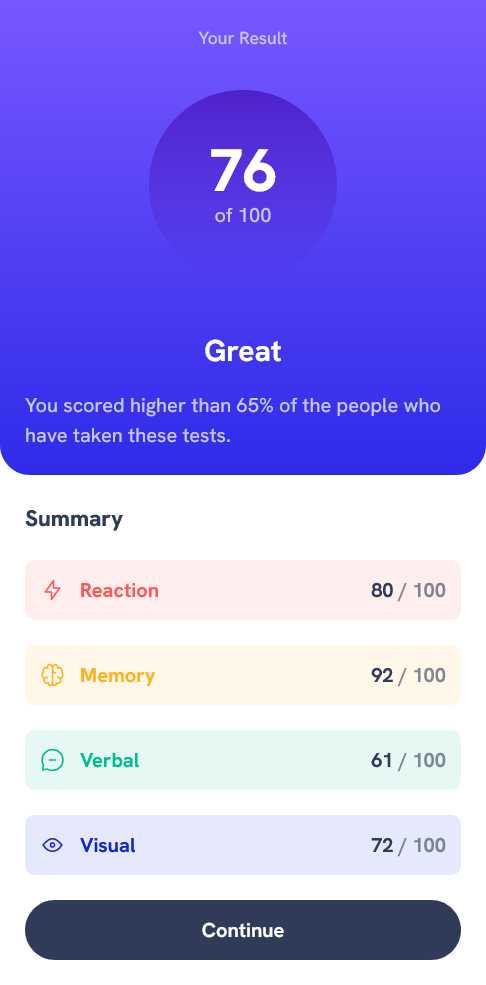

# Mentor Frontend - Solución de componentes de resumen de resultados

Esta es una solución al [desafío del componente de resumen de resultados en Frontend Mentor] (https://www.frontendmentor.io/challenges/results-summary-component-CE_K6s0maV). Los desafíos de Frontend Mentor lo ayudan a mejorar sus habilidades de codificación mediante la creación de proyectos realistas.

## Tabla de contenido

- [Mentor Frontend - Solución de componentes de resumen de resultados](#mentor-frontend---solución-de-componentes-de-resumen-de-resultados)
  - [Tabla de contenido](#tabla-de-contenido)
  - [Descripción general](#descripción-general)
    - [El reto](#el-reto)
    - [Captura de pantalla](#captura-de-pantalla)
      - [Desktop](#desktop)
      - [Mobile](#mobile)
    - [Enlaces](#enlaces)
  - [Mi proceso](#mi-proceso)
    - [Construido con](#construido-con)
  - [Autor](#autor)

## Descripción general

### El reto

Los usuarios deberían poder:

- Ver el diseño óptimo para la interfaz según el tamaño de pantalla de su dispositivo
- Ver estados de desplazamiento y enfoque para todos los elementos interactivos en la página
- **Bonificación**: use los datos JSON locales para completar dinámicamente el contenido

### Captura de pantalla

#### Desktop

#### Mobile

### Enlaces

- URL de la solución: [GitHub](https://github.com/jean266/componente-resumen-de-resultado)
- URL del sitio en vivo: [Vercel](https://componente-resumen-de-resultado.vercel.app/)

## Mi proceso

### Construido con

- Flexbox
- Flujo de trabajo móvil primero
- Tailwindcss
- React + Vite

## Autor

- Mentor de frontend - [@jean266](https://www.frontendmentor.io/profile/jean266)

